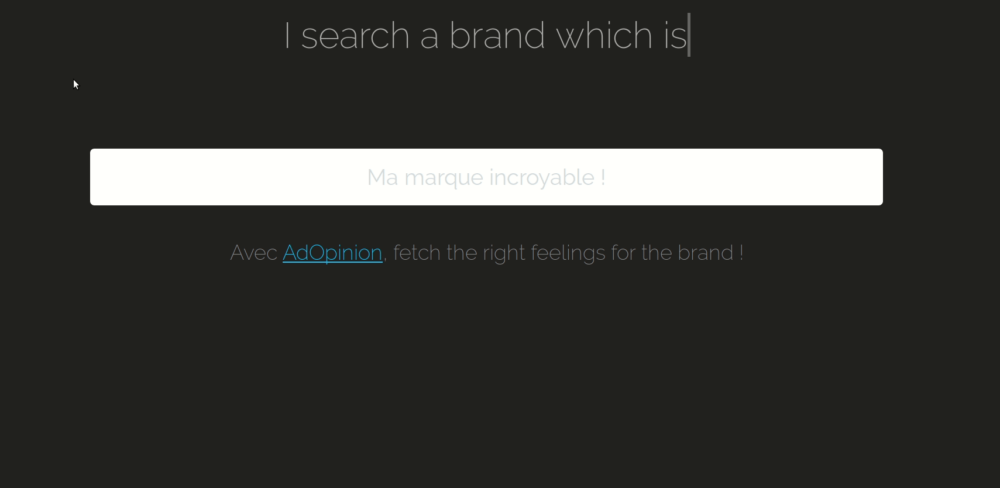
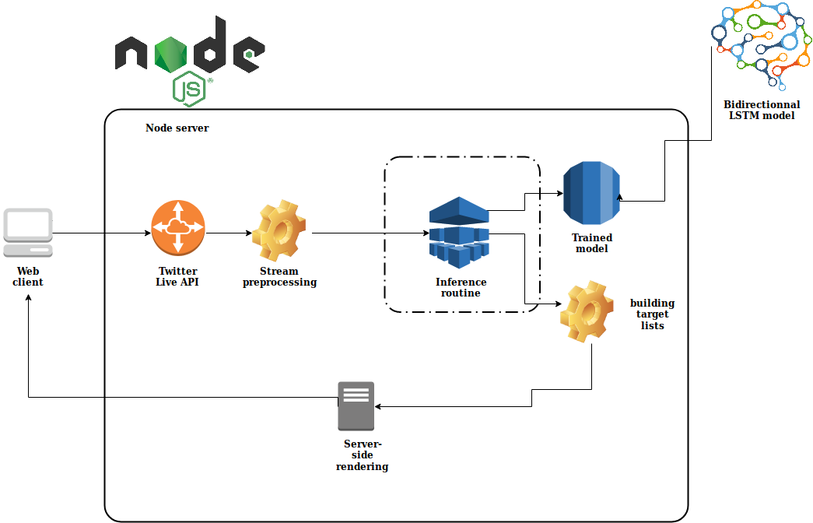

# AdOpinion

A minimalistic advertisement algorithm powered by Sentiment Analysis 

The app schema/topology 

## What it does

It call the Twitter API and fetch the 300 last tweets concerning the brand entered in the search bar (the number of tweets can be modified). Then it analyses these tweets and classify them into 'positive' or 'negative' ones using a trained model (`best_model.hdf5`) based on a bidirectionnal LSTM network.
Finally, it outputs the list of the 'positive users' and the 'negative users' : the 'positive users' are those who 'likes' the brand so a marketing service of this brand may be interested in sending product advertisements to them because they know that they will buy it. On the other side, the 'negative users' will be more excited to watch the 'moral value video' of the brand because those are potential users...

Thus, it target users based on their sentiment and not according some cookies statistics.

## Installation 

* Register in https://developer.twitter.com/ then create an application in the developer console and generate the API keys :
`consumer_key`, `consumer_secret`, `access_token_key` and `access_token_secret`.
* Copy/paste those keys in the `model.js`(AdOpinion/routes/model.js) in the associated field.
* Install [node](https://nodejs.org/en/)
* Then, enter in the terminal : `git clone https://github.com/gabrielmougard/AdOpinion.git && cd AdOpinion && npm install`
* Run `pip3 install -r requirement.txt` to install python3 dependencies.
* Install some dictionnaries : type `python3` in a terminal then enter in the interpreter :
`import nltk` and `nltk.download()` then type `d` and enter the following keywords : `stopwords`, `punkt`, `averaged_perceptron_tagger`, `wordnet`.
* Finally, execute `npm start` in the same terminal and open your web browser where you can type `localhost:3000` to open the platform !

## Important note
* Wait a little bit when you want to click on the two buttons because you have to wait for the predictions (10s max)! 

Cheers !
